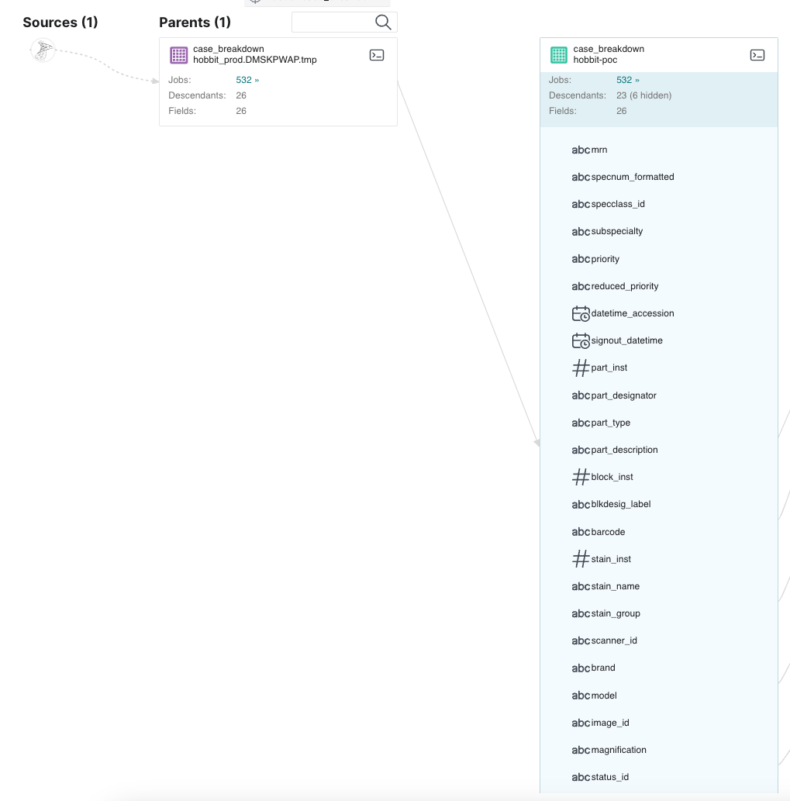
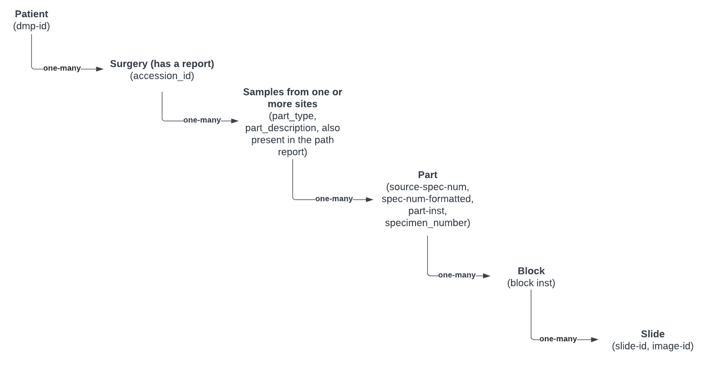

# Case Breakdown Table

# Table of contents
1. [Description](#description)
2. [Assumptions](#assumptions)
3. [Vocabulary and Encoding](#vocabandencoding)
3. [Rules](#rules)

## Description 

The CaseBreakdown table is a table in MSK’s [HoBBIT](https://pubmed.ncbi.nlm.nih.gov/34260720/) (Honest Broker for BioInformatics Technology) database that contains information about anonymized images. HoBBIT is a database in the Department of Pathology (DP) that is designed to compile and share large-scale DP research datasets including anonymized images, redacted pathology reports, and clinical data of patients with consent. 

The CaseBreakdown table in Dremio is a live table that is constantly being updated as new slides are scanned daily. This table may be used by researchers who are interested in using pathology images in their research. Researchers may use this table to search for slides of interest or slides that have been scanned while they build their patient cohorts.

Tissue that is resected from a patient during surgery is sent to DP where it is processed. Tissue may be resected from multiple anatomical sites from a single surgical procedure. Processing involves breaking up the tissue from each anatomical site into parts and blocks. A part can contain many blocks. Both parts and blocks are given designator labels called part number and block number. Certain blocks of interest are then selected to create slides. Tissue from these blocks is also sent for IMPACT sequencing. Typically 10 to 20 slides are created from the blocks and 1 or 2 samples of tissue from the same set of blocks as those that were selected for creating slides is sent for IMPACT sequencing. It is important to try to match the part number and block number from which the IMPACT tissue sample was taken, to the part and block number of the slides in order to find the slides closest to the IMPACT tissue sample. 

### Matching slide data to IMPACT data

In order to match the slides to IMPACT data, we need to ensure that the slides were created at least from the same part, if not block, as the tissue that was taken for IMPACT sequencing. i.e. we try to at least match at the part level. This association needs to be done through the IDs or designator labels that are assigned to each of these items through the accessioning process. The process of accessioning an item is simply to take inventory of the item by assigning it an ID with which it can be tracked in a database. The following database IDs are in play for this matching:

1. image id: ID given to a scanned slide.
2. Anatomical site: The site from which the tissue was resected. This information is usually presented in natural language and is found in the Hobbit casebreakdown table under the column part_description.
3. S Number: The S Number or surgical number is assigned to tissue that is accessioned from a surgery. Example format is S16-22222. The S number is considered PHI and is found in the case breakdown table for each slide under the column named specnum_formatted. The S number is also found in the CHORD table phi_data_lake."cdm-data".pathology."table_pathology_impact_sample_summary_dop_anno.tsv" for each impact sample under the column SOURCE_ACCESSION_NUMBER_0.
4. M Number: The M number or molecular number is assigned to tissue that is sent for an IMPACT sequencing case. Example format is M19-22222. This ID is also considered PHI. The M number is associated with the part and block designator label in the pathology report through a suffix assigned to the ID. Example M19-22222/2:9M. Here the suffix indicates part instance 2 and block designator 9M. The part number from this suffix is extracted using NLP into the CHORD table phi_data_lake."cdm-data".pathology."table_pathology_impact_sample_summary_dop_anno.tsv" for each impact sample under the column SOURCE_SPEC_NUM_0.

Unfortunately, there is no direct link between this format of the M number and the S number that is maintained in any upstream database (at least to our knowledge). This link has to be built out indirectly as follows:

Join Hobbit Casebreakdown table's {slide_id, S number, part number, anatomical site} with the CHORD tables's {impact sample id, S number, part number} on part number to filter out {slide_id, anatomical site, impact sample id}. Through this process, we are now able to identify certain slides that map to IMPACT samples by anatomical site up to the level of a part. There is no known way to map a slide up to a block because the block number is not present in the CHORD tables. 

Incompleteness in this site matched data can arise from the following issues:

1. The M number association with part inst and block designator label may not be well formatted as it is in the case report so this may lead to some data misses
2. There may not be any h&e slides from the part inst and block designator from the M number.
3. There may not be a h&e image id because the slide was never scanned. This can be overcome by requesting for the slide to be scanned.

## Assumptions 
None that are currently known by the data consumers about the environment in which this data was collected. 

### Vocabulary and Encoding 

| FIELD NAME | Description | TYPE Type | Encoding |
|---|---|---|---|
| specnum_formatted | Identifies a surgical procedure | ID | string |
| specclass_id | Description is not known. | ID | string |
| subspecialty | Best guess at description.
Disease management team from which the (solid or liquid) tissue was sourced.  | Categorical Variable | string |
| reduced_priority | Type of patient visit - a summary list | Categorical Variable | string |
| datetime_accession | Date of procedure | Date | date |
| signout_datetime | Description is not known. | Date | date |
| part_inst | Part identifier | ID | integer |
| part_designator | Description is not known. | ID | string |
| part_type | Anatomical site; Tissue extraction method   Example: TRACHEA; RESECTION | Mixed Field | string |
| part_description | Description of the anatomical site from which the part was obtained | Natural Language Description | string |
| block_inst | Block identifier | ID | integer |
| blkdesig_label | Description is not known. | Mixed Field | string |
| barcode | Description is not known. | Mixed Field | string |
| stain_inst | Description is not known. | ID | integer |
| stain_group | Broad category of stain name used to stain the slide | Categorical Variable | string |
| scanner_id | Identifier for the scanner used to scan the slide | ID | string |
| brand | Brand name of the scanner | Categorical Variable | string |
| model | Model name of the scanner | Categorical Variable | string |
| image_id | Identifier for the image that was scanned from the slide | ID_Primary_Key | string |
| magnification | Magnification at which the slide was scanned | Categorical Variable | string |
| status_id | Description is not known. | ID | string |
| file_size_bytes | Size of the scanned image in bytes | Continuous Variable | integer |
| captured_datatime | Description is not known. | Date | date |

## Categorical Variables:

**Subspecialty**

Ordered in descending order of volume of images. 
| subspecialty | Image count | Description |
|:---|---:|:---|
| .Breast|897062 | Best guess at description. Disease management team from which the (solid or liquid) tissue was sourced. UNKNOWN for unknown team.|
.GU |850267||
.GI |735506||
.Heme |514898||
.Derm |504429||
.Thoracic |388824||
.GYN  |355755||
.Head & Neck |266641||
.Bone/Soft tissue |230557||
.Breast 66th |95754||
.Neuro |63237||
Regional Operations |46198||
.Heme-74 |29699||
CG_MSK 53rd Street |5875||
CG_Main Campus 68th Street |1265||
CG_MSK 64th Street |533||
CG_Commack |273||
.Peds |267||
.Breast 64th |71||
UNKNOWN |19||
CG_Hauppauge |16||
NS-6 |1||
NS15 |1||
NS-5 |1||
NS-8 |1||
NS16 |1||
Kimmel| 1|| 

Reduced_priority

| Variable Name | count | Description |
|:---|---:|:---|
| inhouse-surgical| 2864370| Best guess at description. Type of patient visit |
inhouse-biopsy| 1792196||
consult| 1122563||
other| 478545||

Stain_group

| Variable Name | Count | Description |
|:---|---:|:---|
| H&E (Initial) | 3831963| Description is not known.  |
Surgical Submitted| 1087552||
IHC| 583204||
H&E (Other)| 322215||
Other| 193223||
Frozen| 116799 ||
SS|60737 ||

Brand

| Variable Name | Count | Description |
|:---|---:|:---|
| aperio| 6228095| Brand name of scanner. It is assumed that “aperio” and “Aperio” are the same brand.  |
Aperio|14605||
Hamamatsu|12871||
Huron |2103 ||

Model

| Variable Name | Count | Description |
|:---|---:|:---|
| GT450| 3180458| Model of scanner.  |
AT2|3032283||
gt450|17110||
S360|12871||
CS2|12663||
HURON Digital TissueScope IQ|2103||
XT |186||

Magnification

| Variable Name | Count | Description |
|:---|---:|:---|
| 40x| 3235000| Slide magnification |
20x|3020559||
25x|2006||
50x|97||
5x|3||

## Rules 
The second paragraph text
