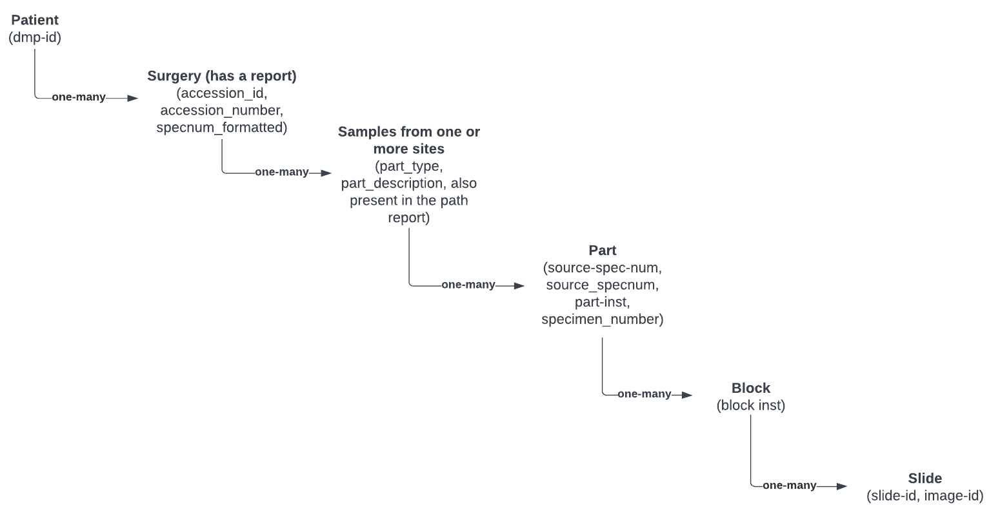
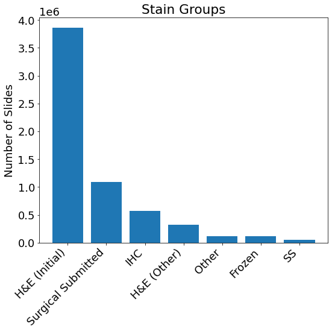
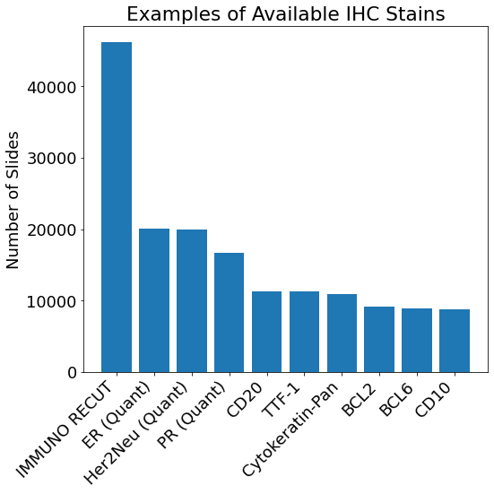
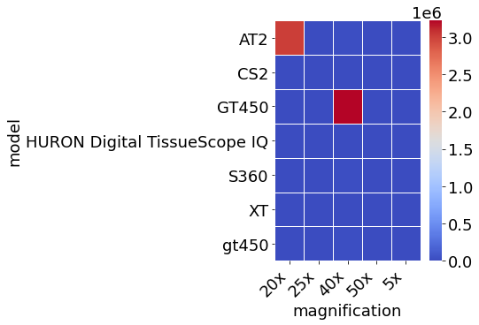

# hobbit_casebreakdown

<b>Path:</b> `"hobbit-poc"."case_breakdown"` <br/>
<b>Table Type:</b> `Live` <br/>
<b>Late updated:</b> `2024-05-17` <br/>

<b>Lineage:</b> 

`HoBBit SQL Server` <br/>
|_ `"hobbit-poc"."case_breakdown"` <br/>

<b>Summary Statistics:</b>

Total number of rows: 6,295,662 <br/>
Total number of unique patients: 369,088 <br/>
Total number of unique slides: 6,192,174 <br/>

<b>Source code for figures:</b> `hobbit-casebreakdown.ipynb`

1. [Description](#description)
2. [Assumptions](#assumptions)
3. [Vocabulary and Encoding](#vocabulary)
3. [Rules](#rules)


## Description <a name="description"></a>

The case_breakdown table, contains information for a slide in each row, indexed by `image_id`, along with the metadata associated with that slide such as a patient ID, (`mrn`), information pertaining to the anatomical site (`part_type`, `part_description`), information about the stain (`stain_name`, `stain_group`), details about the scanner and scanning settings (`scanner_id`, `brand`, `model`, `magnification`) and additional metadata that pertain to the clinical workflow.

##### How was this data collected? 

Tissue that is resected from a patient (identified by `mrn`) during surgery (`specnum_formatted`) is sent to the Dept. of Pathology where it is processed. Tissue may be resected from multiple anatomical sites from a single surgical procedure. Processing involves breaking up the tissue from each anatomical site (`part_type`, `part_description`) into parts (`part_inst`) and blocks (`block_inst`, `blkdesig_label`). A part can contain many blocks. Both parts and blocks are given designator labels called part number and block number. Certain blocks of interest are then selected to create slides.

The figure below illustrates the identifier hierarchy and also provides commonly used names/aliases for each of the identifiers.

 

##### What are the types of slides that are available? 

HoBBIT also contains data corresponding to H&E and IHC stains. For the most part, IHC stains are less available across cancer types than H&E stains. 

 
 

Slides tend to be scanned at either 20x or 40x power depending on the scanner used. Slides scanned at 40x are higher resolution, but also twice the file size (on average .52GB vs 1.15GB). The slide scanning power is largely determined by the scanner model used. There are some slides scanned at other resolutions, but those should be reviewed on a case-by-case basis. 

 

## Assumptions <a name="assumptions"></a>

None.

## Vocabulary & Encoding <a name="vocabulary"></a>

Total number of Columns: 26

The columns below are relevant or research purposes.  

| **Field name** | **Description** | **Field Type** | **Encoding** |
|---|---|---|---|
| `mrn` | Medical Record Number, a unique identifier per patinet  | ID | string |
| `specnum_formatted` | Identifies the surgical procedure.  | ID | string |
| `part_inst` | Part identifier. Organs are divided into multiple parts to identify locations of specimens in the organ. | ID | integer |
| `part_type` | The part, or specimen name. Usually formatted as: Anatomical site; Tissue extraction method <br> Example: TRACHEA; RESECTION | Mixed Field | string |
| `part_description` | Description of the anatomical site from which the part was obtained. | Natural Language Description | string |
| `block_inst` | Tissues of specific parts can be fixed in one or more paraffin blocks. This number specifies which block the specimen originates from. | ID | integer |
| `blkdesig_label` | This ID also specifies the block the specimen originates from. | ID | string |
| `barcode` | A unique ID of a glass slide with a prepared tissue specimen.| Mixed Field | string |
| `stain_group` | Broad category of stain name used to stain the slide (H&E vs IHC)| Categorical Variable | string |
| `stain_name` | The specific stain used on the slide. This is useful for identifying different IHC stains. | Categorical Variable | string |
| `brand` | Manufacturer of the scanner | Categorical Variable | string |
| `model` | Model of the scanner | Categorical Variable | string |
| `image_id` | Unique ID for the digitized image | ID (Primary Key) | string |
| `magnification` | Magnification at which the slide was scanned | Categorical Variable | string 
| `file_size_bytes` | Size of the scanned image in bytes | Continuous Variable | integer |


The columns below are relevant to clinical operations and may not be useful for research purposes.  

| **Field name** | **Description** | **Field Type** | **Encoding** |
|---|---|---|---|
| `specclass_id` | Description is not known. | ID | string |
| `subspecialty` | Description is not unknown. Related to disease management team from which the (solid or liquid) tissue was sourced.  | Categorical Variable | string |
| `reduced_priority` | Type of patient visit - a summary list | Categorical Variable | string |
| `datetime_accession` | Date of procedure | Date | date |
| `signout_datetime` | Description is not known. Related to pathology image sign off | Date | date |
| `status_id` | Description is not known. | ID | string |
| `captured_datatime` | Datetime when the image was captured by the scanner | Date | date |

# Rules <a name="rules"></a>

1. Not all slides created at MSK are scanned and represented in this dataset.
2. Not all slides in this dataseet can be used for research. About 1% of the slides cannot be de-identified and therefore cannot be used for research.
3. There are slides scanned strictly for research purposes that are potentially absent from this database, particularly if a novel or new scanner was used in the research workflow.
4. A vast majority of the slides to be used for research purposes are scanned at either 20x or 40x. Some slides may be scanned at 50x or 25x.
5. On average a 40x scan is 1.15GB  and a 20x scan is around 0.50GB.
6. The following columns of interest for research contain missing values for some rows.

```
Column Name           # missing values
part_designator             3
block_inst             778499
blkdesig_label         778501
barcode                     2
stain_name                290
stain_group             62006
magnification               9
file_size_bytes           191
```


