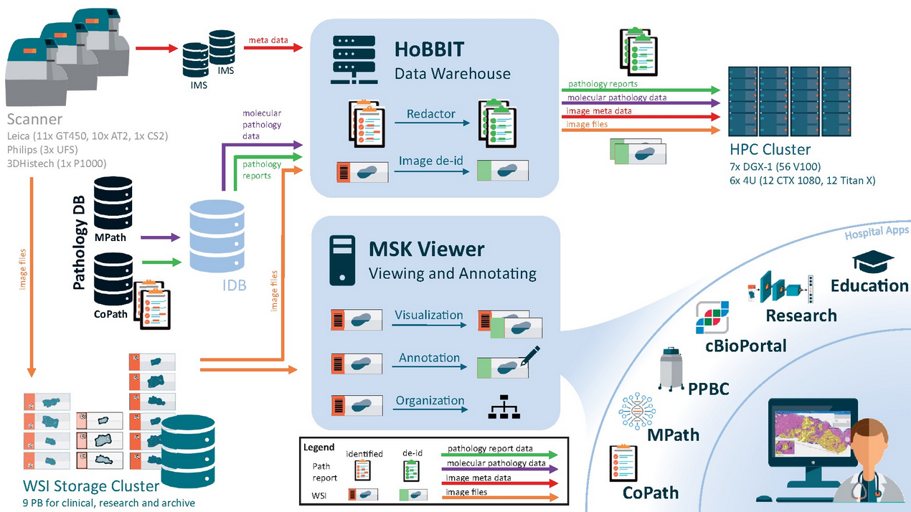

<b>Data Product Owner:</b> Luke Geneslaw

HoBBIT [(Honest Broker for BioInformatics Technology)](https://academic.oup.com/jamia/article/28/9/1874/6321440) is a database maintained by the Department of Pathology containing metadata for all digitized slides processed as part of their clinical workflow. 

 

## Datasets:
[hobbit_casebreakdown](hobbit-casebreakdown.md) - scanned pathology slide metadata  
[hobbit_casebreakdown_cleaned](hobbit-casebreakdown.md)  - curated version of hobbit_casebreakdown dataset
