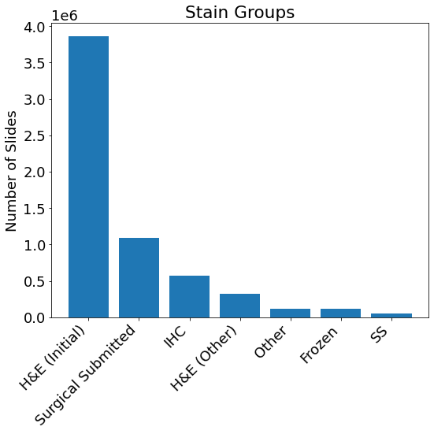

# HoBBIT 

Late updated 2024-05-17

Source code: `hobbit-casebreakdown.ipynb`


1. [Description](#description)
2. [Assumptions](#assumptions)
3. [Vocabulary and Encoding](#vocabulary)
3. [Rules](#rules)


## Description <a name="description"></a>

### Motivation
HoBBIT is the institutional database that keeps records of all pathology slides digitized as part of the hospital's clinical workflow. As such, it's the source of the majority of our digital slide data used for research projects. 

### What is HoBBIT?

HoBBIT [(Honest Broker for BioInformatics Technology)](https://academic.oup.com/jamia/article/28/9/1874/6321440) is a database maintained by the
Department of Pathology containing metadata for all digitized slides processed as part of their clinical workflow [^1]. 

 


In so-called "casebreakdown" database, each row represents a slide, indexed by `image_id`, along with the metadata associated with that slide such as a patient ID, (`mrn`), information pertaining to the anatomical site (`part_type`, `part_description`), information about the stain (`stain_name`, `stain_group`), details about the scanner and scanning settings (`scanner_id`, `brand`, `model`, `magnification`) and additional metadata that pertain to the clinical workflow. 


The table in Dremio is a live table that is constantly being updated as new slides are scanned. This table may NOT be directly used by researchers because it contains PHI. If you'd like access to the table directly, please contact the PDM engineering team. 

### Access
The table can be accessed via dremio here: `"hobbit-poc"."case_breakdown"` 

If you do not have permissions on this table, please contact the engineering team. 

### How should this data be used?

The most immediate use of this data is to find pathology slides associated with a set of patients. More specifically, this data has been matched with IMPACT data to associate pathology slides with the closest corresponding IMPACT sample. In generally, researchers may use this table to search for slides of interested or slides that have been scanned while they build their patient cohorts.  

Users interested in working with slide images should contact the engineering team. We highly recommend not using this table directly, but the cleaned version discussed here. 

### How often is this data updated?

This data is updated live, as new slides are digitized and entered into HoBBIT. This data is managed by the Department of Pathology, specifically Luke Geneslaw. 

### How was this data collected?

Tissue that is resected from a patient (identified by `mrn`) during surgery (`specnum_formatted`) is sent to the Dept. of Pathology where it is processed. Tissue may be resected from multiple anatomical sites from a single surgical procedure. Processing involves breaking up the tissue from each anatomical site (`part_type`, `part_description`) into parts (`part_inst`) and blocks (`block_inst `). A part can contain many blocks. Both parts and blocks are given designator labels called part number and block number. Certain blocks of interest are then selected to create slides.

 


#### What does each row represent?
Each row represents a single, digitized slide with metadata related to the collection process and the digitization process. The primary key is the `image_id`. 


## Assumptions <a name="assumptions"></a>


#### Does this database contain all possible slides?

In short, no. There has been an effort in recent years to retrospectively digitize all slides from all available patient surgeries, but there is still some missing-ness.

Furthermore, just because a slide is documented in HoBBIT, does not mean that the slide can be used for research, in rare occurrences (~1%), the slide itself contains PHI and cannot be de-identified for research purposes. 


Finally, there are slides scanned strictly for research purposes that are potentially absent from this database, particularly if a novel or new scanner was used in the research workflow. 


## Vocabulary & Encoding <a name="vocabulary"></a>

Each row contains data in 26 columns. Below, we outline the most useful fields. All other fields are used as part of the clinical workflow and are not required for research purposes. These fields are outlined here: 

| **Field name** | **Description** | **Field Type** | **Encoding** |
|---|---|---|---|
| `mrn` | Medical Record Number, a unique identifier per patinet  | ID | string |
| `specnum_formatted` | Identifies the surgical procedure.  | ID | string |
| `part_inst` | Part identifier. Organs are divided into multiple parts to identify locations of specimens in the organ. | ID | integer |
| `part_type` | The part, or specimen name. Usually formatted as: Anatomical site; Tissue extraction method <br> Example: TRACHEA; RESECTION | Mixed Field | string |
| `part_description` | Description of the anatomical site from which the part was obtained. | Natural Language Description | string |
| `block_inst` | Tissues of specific parts can be fixed in one or more paraffin blocks. This ID specifies the block the specimen originates from. | ID | integer |
| `barcode` | A unique ID of a glass slide with a prepared tissue specimen.| Mixed Field | string |
| `stain_group` | Broad category of stain name used to stain the slide (H&E vs IHC)| Categorical Variable | string |
| `stain_name` | The specific stain used on the slide. This is useful for identifying different IHC stains. | Categorical Variable | string |
| `brand` | Manufacturer of the scanner | Categorical Variable | string |
| `model` | Model of the scanner | Categorical Variable | string |
| `image_id` | Unique ID for the digitized image | ID (Primary Key) | string |
| `magnification` | Magnification at which the slide was scanned | Categorical Variable | string 
| `file_size_bytes` | Size of the scanned image in bytes | Continuous Variable | integer |


#### Is there any information missing? 

Yes, there are fields with missing data. 

```
subspecialty          1272200
priority                   14
signout_datetime        19319
part_designator             3
block_inst             778499
blkdesig_label         778501
barcode                     2
stain_name                290
stain_group             62006
magnification               9
file_size_bytes           191

```
Most of these fields are used for operations and are not relevant for research, so this level of missing-ness is permissible. 


#### What kind of slides are available? 

HoBBIT also contains data corresponding to H&E and IHC stains. For the most part, IHC stains are less available across cancer types than H&E stains. 

 
 


Slides tend to be scanned at either 20x or 40x power depending on the scanner used. Slides scanned at 40x are higher resolution, but also twice the file size (on average .52GB vs 1.15GB). The slide scanning power is largely determined by the scanner model used. There are some slides scanned at other resolutions, but those should be reviewed on a case-by-case basis. 

 


#### Supplementary fields
Here we provide a condensed summary of available fields. These are mostly use for hospital operation and not relevant for research. 

| **Field name** | **Description** | **Field Type** | **Encoding** |
|---|---|---|---|
| `specclass_id` | Description is not known. | ID | string |
| `subspecialty` | Description is not unknown. Related to disease management team from which the (solid or liquid) tissue was sourced.  | Categorical Variable | string |
| `reduced_priority` | Type of patient visit - a summary list | Categorical Variable | string |
| `datetime_accession` | Date of procedure | Date | date |
| `signout_datetime` | Description is not known. Related to pathology image sign off | Date | date |
| `status_id` | Description is not known. | ID | string |
| `captured_datatime` | Datetime when the image was captured by the scanner | Date | date |

# Rules <a name="rules"></a>

#### How many rows are there in total?
There are  6,295,662 rows, coresponding to data from 369,088 unique patients. There are 6,192,174 unique `image_id`s in total. A subset of the duplicates are entirely duplicated rows. However, in extreme minority of cases, the same `image_id` will have different collection and digitization metadata. These slides need to be removed entirely from the database prior to any use.
 
```
-- Row count
select count(*)  FROM "hobbit-poc"."case_breakdown"

-- image_id Count
select count(DISTINCT(image_id))  FROM "hobbit-poc"."case_breakdown"

```

#### PHI
Not all of the slides in HoBBIT can be used for research. In practice, roughly 1% of requested slides contain PHI on the slide itself and thus cannot be de-identified for research use. This cannot be determined via HoBBIT, and is only determined during data transfer. 


#### Slide Resolution
A vast majority of the slides to be used for research purposes are scanned at either 20x or 40x. If you find yourself working with a slide scanned at 50x or 25x, then double check to make sure that you're sure about your slide selection. 


#### Image Size
Digitized slides scanned at 40x tend to be twice the size of 20x slides, (on average 1.15GB vs .52GB)


[^1]: This means that slides specifically requested to be scanned for research purposes may not be in HoBBIT

