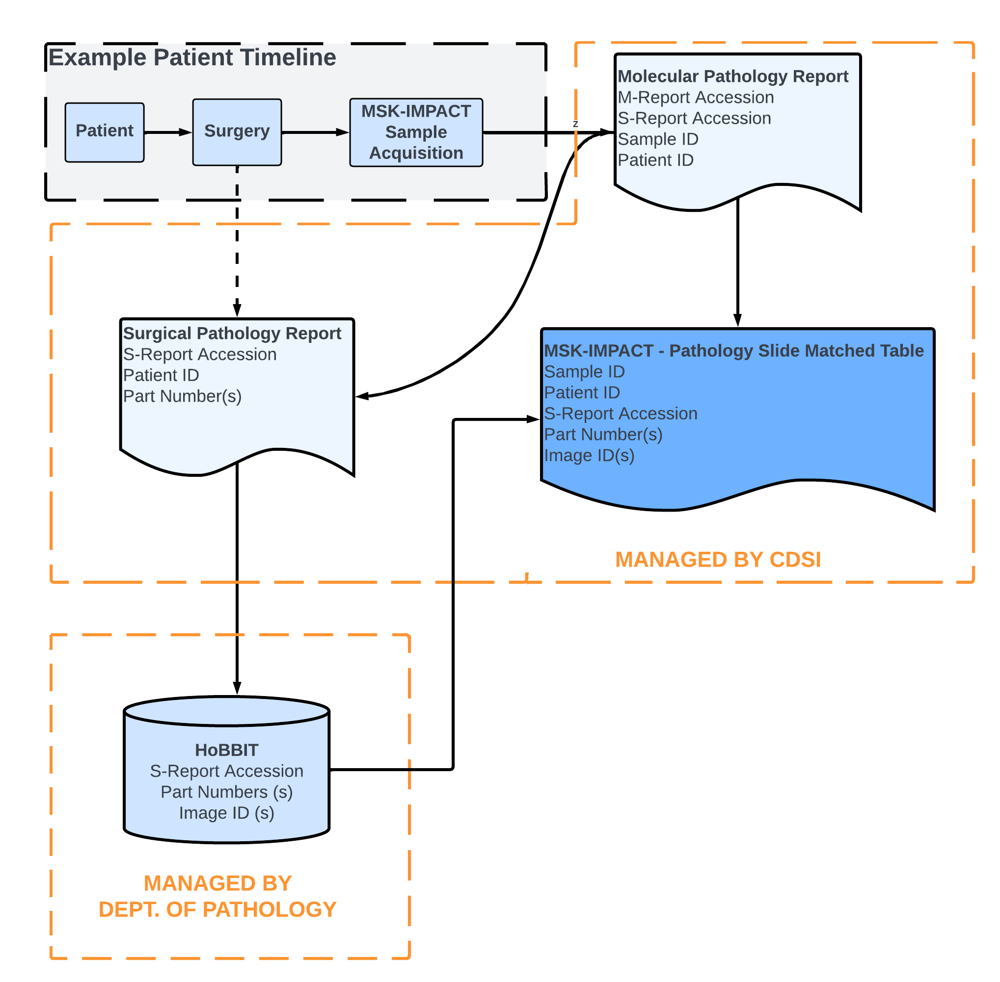

# MSK-IMPACT to Pathology Slide Matching Schema

Late updated 2024-05-16

1. [Description](#description)
2. [Assumptions](#assumptions)
3. [Vocabulary and Encoding](#vocabulary)
3. [Rules](#rules)

## Description <a name="description"></a>

### Motivation

This data provides a way to retrieve pathology slides associated with patients that have had MSK-IMPCAT sequencing.

This involves bringing together several tables from the Department of Pathology and CDSI data sources. By presenting this data in a single view, we look to improve the consistency in data engineering, cohort selection and project upkeep. 


### How was this data put together?

For patients that receive MSK-IMPACT sequencing, we check to see if there is a surgical pathology report reference in the DMP report via regex. If available, then we have
access to the surgical accession number (`SOURCE_ACCESSION_NUMBER`) and the tissue specimen number (`SOURCE_SPEC_NUM`) associated with each MSK-IMPACT sample. 

Using this table, we can then reference [HoBBIT](#HoBBIT), a broker of slide metadata managed by
the department of pathology, that contains slide metadata associated with all pathology slides digitized as part of the clinical workflow. This data is indexed by a unique
`image_id` per digitized slide, and also contains the `specnum_formatted` that matches
the surgical accession number and the `part_inst` which matches the tissue specimen number for each slide. 

Merging the MSK-IMPACT table with the surgical and tissue specimen numbers with the HoBBIT
database then allows us to directly match the slides from the specimen and surgery that are referenced in the DMP report. 

This process involves merging two tables, the IMPACT pathology report table (`"pathology-data-mining"."impact_slide"."impact-path_report_accession"`) and the cleaned HoBBIT table (`""pathology-data-mining"."impact_slide"."case_breakdown_cleaned""`). 




```
SELECT*
FROM (
  SELECT *, CONVERT_TO_INTEGER("impact-path-report".SOURCE_SPEC_NUM_0, 1, 1, 0) AS SOURCE_SPEC_NUM_INT
  FROM "pathology-data-mining"."impact_slide"."impact-path_report_accession" AS "impact-path-report"
) nested_0
 INNER JOIN "pathology-data-mining"."impact_slide"."case_breakdown_cleaned" AS "join_casebreakdown-cleaned" ON nested_0.MRN = "join_casebreakdown-cleaned".mrn AND nested_0.SOURCE_ACCESSION_NUMBER_0 = "join_casebreakdown-cleaned".specnum_formatted AND nested_0.SOURCE_SPEC_NUM_INT = "join_casebreakdown-cleaned".part_inst
```


### How should this data be used?

This is the final table that should be used to construct cohorts of matched MSK-IMPACT samples to pathology slides.


### Access
You can access this data here: `"pathology-data-mining"."impact_slide"."impact_slide"`

### How often is this data updated

This data is updated daily as the source tables are updated.


## Assumptions <a name="assumptions"></a>


## Vocabulary & Encoding <a name="vocabulary"></a>

See CDSI/IMPACT documentation and HoBBIT datasheet.

- [CDM Codebook](https://docs.google.com/spreadsheets/d/1po0GdSwqmmXibz4e-7YvTPUbXpi0WYv3c2ImdHXxyuc/edit#gid=187767892)
- [HoBBIT casebreakdown datasheet](https://github.com/msk-mind/datasheets-for-datasets/blob/impact-exploration/impact-slide/hobbit/hobbit-casebreakdown.md)


## Rules <a name="rules"></a>

### How many rows are there in total? 

There are a total of 469,703 rows, corresponding to data from 65,892 samples from 56,858 patients. In total, there are 461,184 slides. 

```
-- Row count
select count(*)  FROM "pathology-data-mining"."impact_slide"."impact_slide"

-- sample Count
select count(DISTINCT(SAMPLE_ID))  FROM "pathology-data-mining"."impact_slide"."impact_slide"

-- patient Count
select count(DISTINCT(PATIENT_ID))  FROM "pathology-data-mining"."impact_slide"."impact_slide"

-- slide Count
select count(DISTINCT(IMAGE_ID))  FROM "pathology-data-mining"."impact_slide"."impact_slide"


```


