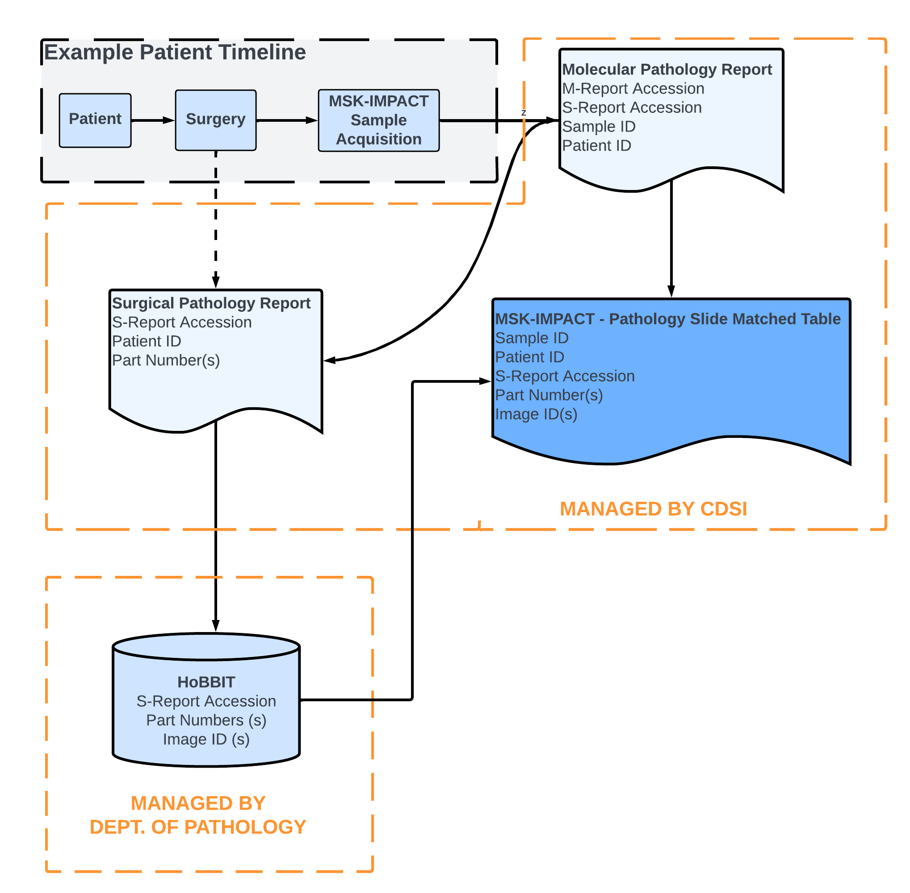
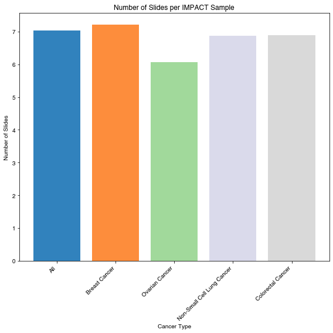
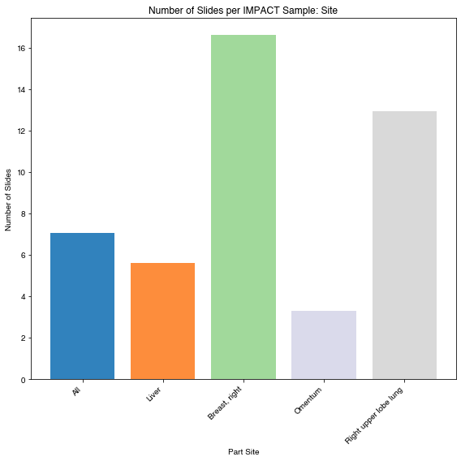
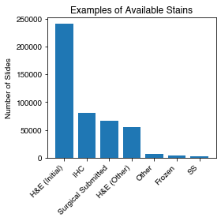
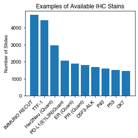
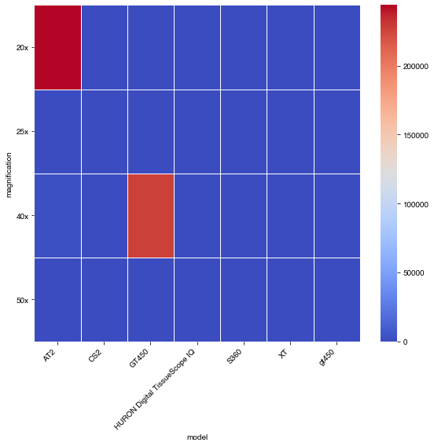
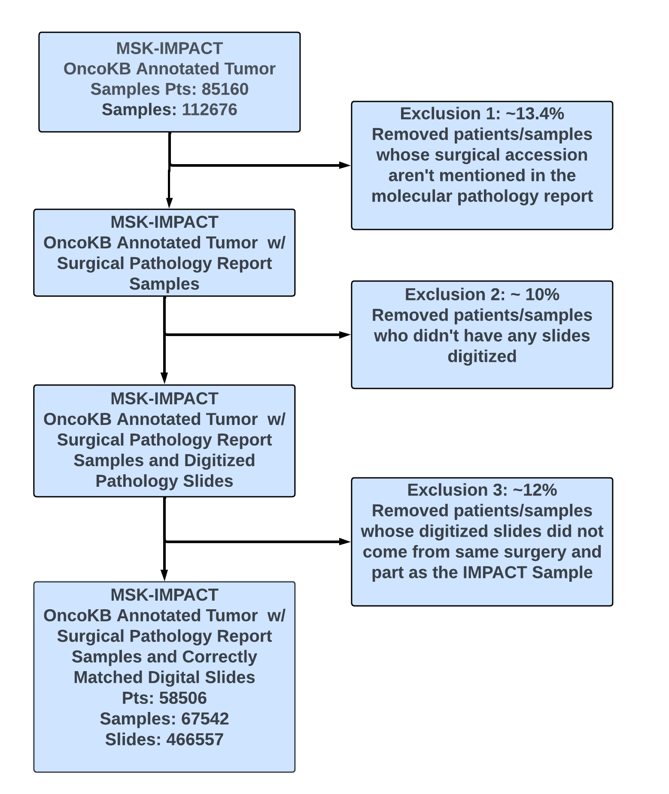

# MSK-IMPACT to Pathology Slide Matching Schema

## Objective:

This data provides a way to retreive pathology slides associated with patients that have had MSK-IMPCAT sequencing. 

This involves bringing together several tables from the Department of Pathology and CDSI data sources. By presenting this data in a single view, we look to improve the consistency in data engineering, cohort selection and project upkeep. 

TODO: update alll tables in dremio/add references here

## Methodology

For patients that receive MSK-IMPACT sequencing, we check to see if there is a surgical pathology report reference in the DMP report via regex. If available, then we have
access to the surgical accession number (`SOURCE_ACCESSION_NUMBER`) and the tissue specimen number (`SOURCE_SPEC_NUM`) associated with each MSK-IMPACT sample. 

Using this table, we can then reference [HoBBIT](#HoBBIT), a broker of slide metadata managed by
the department of pathology, that contains slide metadata associated with all pathology slides digitized as part of the clinical workflow. This data is indexed by a unique
`image_id` per digitized slide, and also contains the `specnum_formatted` that matches
the surgical accession number and the `part_inst` which matches the tissue specimen number for each slide. 

Merging the MSK-IMPACT table with the surgical and tissue specimen numbers with the HoBBIT
database then allows us to directly match the slides from the specimen and surgery that are referenced in the DMP report. 

### Patient Timeline

Tissue that is resected from a patient during surgery is sent to the pathology department where it is processed. Tissue may be resected from multiple anatomical sites from a single surgical procedure. Processing involves breaking up the tissue from each anatomical site into parts and blocks. A part can contain many blocks. Both parts and blocks are given designator labels called part number and block number. Certain blocks of interest are then selected to create slides. Tissue from these blocks is also sent for IMPACT sequencing. Typically multiple (up to as many as 20 or more)slides are created from the blocks and 1 or 2 samples of tissue from the same set of blocks as those that were selected for creating slides is sent for IMPACT sequencing.

## Data Overview

After merging the above tables, we have a single table that contains de-identified patient IDs, MSK-IMPACT sample IDs, and their associated pathology slides and associated pathology slide metadata. 

Per IMPACT sample, we have multiple slides. The number of slides per sample is variable and dependent on the cancer type and the tissue site/part. The process of slide selection, within the set is a choice dependent on the scientific objective. 

HoBBIT also contains data corresponding to H&E and IHC stains. For the most part, IHC stains are less available across cancer types than H&E stains. 

 
 

Slides tend to be scanned at either 20x or 40x power depending on the scanner used. Slides scanned at 40x are higher resolution, but also twice the file size (on average .52GB vs 1.15GB). The slide scanning power is largely determined by the scanner model used. There are some slides scanned at other resolutions, but those should be reviewed on a case-by-case basis. 
 

### Important Fields 

Below is a summary and description of the important fields in the table that are unique to this table and not commonly found in other CDSI tables. All other fields are either documented by the CDSI/CDM team, commonly found elsewhere, or aren't relevant for research. An exhaustive summary of the HoBBIT data fields can be found here (provide reference once we hear back from Luke)

| **Field name** | **Description** | **Field Type** | **Encoding** |
|---|---|---|---|
| `specnum_formatted` | Identifies the surgical procedure.  | ID | string |
| `part_inst` | Part identifier. Organs are divided into multiple parts to identify locations of specimens in the organ. | ID | integer |
| `part_type` | The part, or specimen name. Usually formatted as: Anatomical site; Tissue extraction method   Example: TRACHEA; RESECTION | Mixed Field | string |
| `part_description` | Description of the anatomical site from which the part was obtained. | Natural Language Description | string |
| `block_inst` | Tissues of specific parts can be fixed in one or more paraffin blocks. This ID specifies the block the specimen originates from. | ID | integer |
| `barcode` | A unique ID of a glass slide with a prepared tissue specimen.| Mixed Field | string |
| `stain_group` | Broad category of stain name used to stain the slide | Categorical Variable | string |
| `stain_name` | The specific stain used on the slide. This is useful for identifying different IHC stains. | Categorical Variable | string |
| `model` | Model of the scanner | Categorical Variable | string |
| `image_id` | Unique ID for the digitized image | ID | string |
| `magnification` | Magnification at which the slide was scanned | Categorical Variable | string |

### Case Inclusion Diagram

Updated as of 2024-05-06

TODO: explain exclusions

## Data Sources:

### <a name='HoBBIT'><a/> HoBBIT 

[HoBBIT (Honest Broker for BioInformatics Technology)](https://academic.oup.com/jamia/article/28/9/1874/6321440) is a database maintained by the
Department of Pathology (contact: Luke Geneslaw) containing metadata for all digitized slides processed as part of their clinical workflow [^1]. 

In this database, each row represents a slide, indexed by `image_id`, along with the metadata associated with that slide such as a patient ID, (`mrn`), information pertaining to the anatomical site (`part_type`, `part_description`), information about the stain (`stain_name`, `stain_group`), details about the scanner and scanning settings (`scanner_id`, `brand`, `model`, `magnification`) and additional metadata that pertain to the clinical workflow. 

The table in Dremio is a live table that is constantly being updated as new slides are scanned. This table may NOT be directly used by researchers because it contains PHI. If you'd like access to the table directly, please contact the PDM engineering team. 

### CDSI Data

We pull data from the CDSI repos nightly to maintain a list of samples that we use to match with pathology slides. Specifically, we pull the [OncoKB-annotated MSK sequencing cohort](https://github.mskcc.org/cdsi/oncokb-annotated-msk-impact) and limit ourselves to tumor samples (excluding cf-DNA samples), and merge it with [patient level data](https://github.mskcc.org/cdsi/msk-impact/tree/master/msk_solid_heme) for convenience. For more information about CDSI-related fields, please reference the CDM/CDSI documentation. 

Please contact the PDM engineering team if you cannot access the above sources. 

#### Pathology Accession Table

In addition to the CDSI repos, we also pull data from a pathology accession table maintained by the CDM team. This table contains a mapping between de-identified MSK-IMPACT sample and patient IDs, MRNs and surgical accessions mined from the molecular pathology report. Not all molecular pathology reports reference a surgical accession, which explains the first exclusion step (NOTE: VERIFY THIS) 

This table may NOT be directly used by researchers, if you'd like to this table directly, please contact the PDM engineering team. 

# FAQs

1. Why do we have multiple slides per IMPACT sample?

2. What are all of the various IDs?

3. Why can't we match all the way down to the tissue block (the finest-grain match)?

 The tissue block used for sequencing is not consistently documented in our data sources. 

# Supplementary Information

[^1]: This means that slides specifically requested to be scanned for research purposes may not be in HoBBIT

