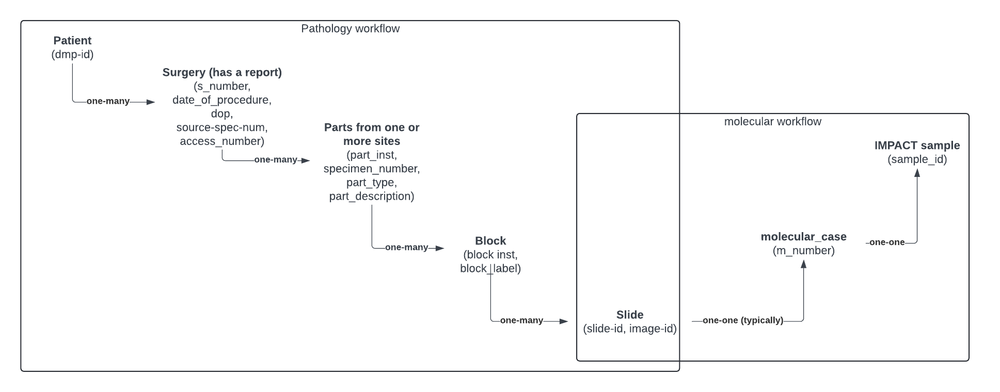

# PDM Product Tables (`pdm_product_cdsi`)

The Pathology Data Mining (PDM) team curates a collection of whole-slide-image (WSI) product tables that currently live in the **`cdsi_res_deid.pdm_product_cdsi`** schema on [msk-mode-prod](https://msk-mode-prod.cloud.databricks.com/explore/data/cdsi_res_deid/pdm_product_cdsi). Every table has been de-identified for research use, and the MSK tables are scoped to the IMPACT cohort so that each slide can be tied back to its matching MSK-IMPACT genomic sample.

Unless noted otherwise, MSK tables are **IMPACT-scoped**: they are restricted to slides that match an MSK-IMPACT sample and lead with the identifiers `image_id`, `PATIENT_ID_IMPACT`, and `SAMPLE_ID_IMPACT`. MSK tables are additionally **restricted to patients who have provided Part A research consent**; slides belonging to patients without Part A consent are excluded. TCGA tables exist outside IMPACT and are kept whole (no IMPACT identifiers, no Part A restriction).

> **Note:** These tables are staged in `cdsi_res_deid.pdm_product_cdsi` pending publication to the `product_cdsi` catalog, which as of 2026-09-18 holds only the cBioPortal schemas (`msk_impact`, `msk_archer`, `tempo`, `gene_panels`). A `pdm_product_cdsi_dev` schema holds the development copies. Counts in these datasheets were taken on 2026-09-18.

> **Note:** Every IMPACT-scoped table repeats a slide once per matching `SAMPLE_ID_IMPACT`, and the v2 embedding inventories repeat it again per `model`, so row counts exceed slide counts. See each datasheet's Notes section.

## How was this data collected?

Tissue that is resected (or biopsied) from a patient (identified by `mrn`) during a surgical event (`specnum_formatted`) is sent to the Dept. of Pathology where it is processed. Tissue may be resected from multiple anatomical sites from a single surgical procedure. Processing involves breaking up the tissue from each anatomical site (often represented as `part_type`, `part_description`) into parts (often represented as `part_inst`) and blocks (often represented as `block_inst`, `blkdesig_label`, `block_label`). A part can contain many blocks. Both parts and blocks are given designator labels called part number and block number. Certain blocks of interest are then selected to create slides.

Tissue from one or more slides is then scraped from regions of interest (ROI) and sent for molecular sequencing. The molecular sequencing process results in a molecular case number (often referred to as an M-number, or `accession_number_dmp`) and a `sample_id`, typically from the IMPACT protocol.

The figure below illustrates the identifier hierarchy and also provides commonly used names/aliases for each of the identifiers.

## What are the types of slides that are available?

HoBBIT contains data corresponding to H&E and IHC stains. For the most part, IHC stains are less available across cancer types than H&E stains.

Slides tend to be scanned at either 20x or 40x power depending on the scanner used. Slides scanned at 40x are higher resolution, but also roughly twice the file size (on average 0.52GB vs 1.15GB). The slide scanning power is largely determined by the scanner model used. There are some slides scanned at other resolutions, but those should be reviewed on a case-by-case basis.

## Table sizes

| Table | Rows | Slides (distinct image_id) | IMPACT patients | IMPACT samples |
|---|---|---|---|---|
| slides_with_diagnosis_v1 | 696,758 | 683,953 | 75,490 | 87,393 |
| impact_matched_slides_v1 | 657,598 | 645,067 | 70,352 | 81,707 |
| msk_slide_inventory_v1 | 652,495 | 640,689 | 74,651 | 86,439 |
| msk_reef_v1_embeddings_inventory_v1 | 512,747 | 504,120 | 71,412 | 82,078 |
| msk_reef_v2_embeddings_inventory_v1 | 1,629,873 | 535,083 | 70,009 | 80,631 |
| impact_block_matched_slides_v1 | 168,853 | 168,712 | 35,254 | 38,983 |
| tcga_slide_inventory_v1 | 11,741 | 11,741 | n/a | n/a |
| tcga_reef_v1_embeddings_inventory_v1 | 10,925 | 10,925 | n/a | n/a |
| tcga_reef_v2_embeddings_inventory_v1 | 23,601 | 11,802 | n/a | n/a |

## Datasets:

### Matched slides
[impact_matched_slides_v1](impact_matched_slides_v1.md) - slides matched to IMPACT samples at the **part** level, with IMPACT genomic annotations.  
[impact_block_matched_slides_v1](impact_block_matched_slides_v1.md) - slides matched to IMPACT samples at the finer **block** level.  

### Diagnoses
[slides_with_diagnosis_v1](slides_with_diagnosis_v1.md) - IMPACT-matched slides with parsed pathology diagnoses.  

### Slide inventories
[msk_slide_inventory_v1](msk_slide_inventory_v1.md) - storage inventory of IMPACT-matched MSK slides.  
[tcga_slide_inventory_v1](tcga_slide_inventory_v1.md) - storage inventory of TCGA slides.  

### Embeddings inventories
[msk_reef_embeddings_inventory](msk_reef_embeddings_inventory.md) - v1 & v2 embedding inventories for IMPACT-matched MSK slides.  
[tcga_reef_embeddings_inventory](tcga_reef_embeddings_inventory.md) - v1 & v2 embedding inventories for TCGA slides.  
